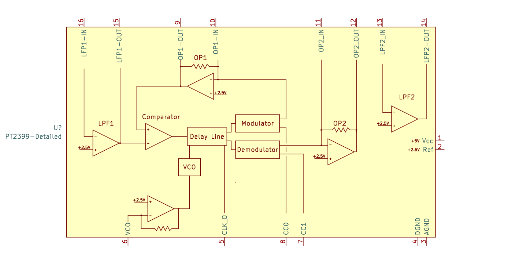

# PT2399 detailed KiCad symbol

The footprint is based on
[this excellent article by ElectroSmash.][electrosmash]

[Example PT2399 circuit](./pt2399-example.pdf)

## Install

* Download or checkout this repo
* In KiCad click **Preferences** -> **Manage Symbol Libraries**
* Click on the folder icon, select the downloaded
  `pt2399.kicad_sym` file

[electrosmash]: https://www.electrosmash.com/pt2399-analysis

## License

MIT
